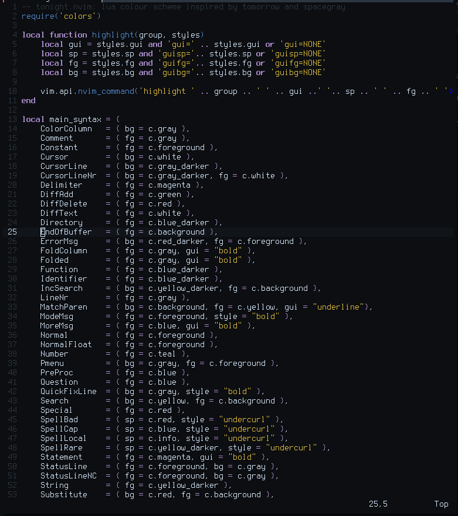
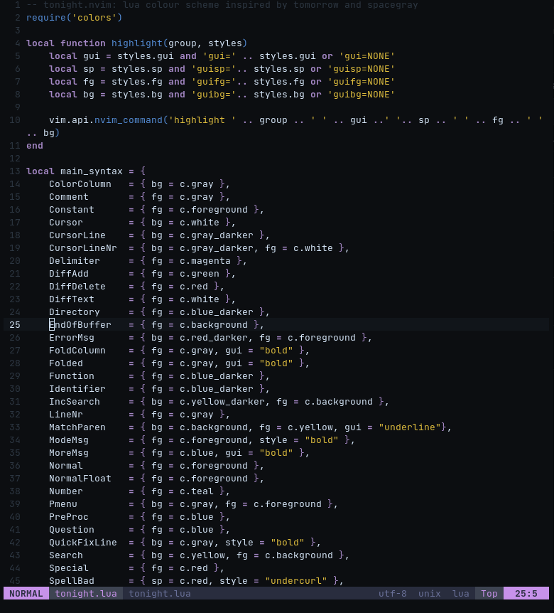
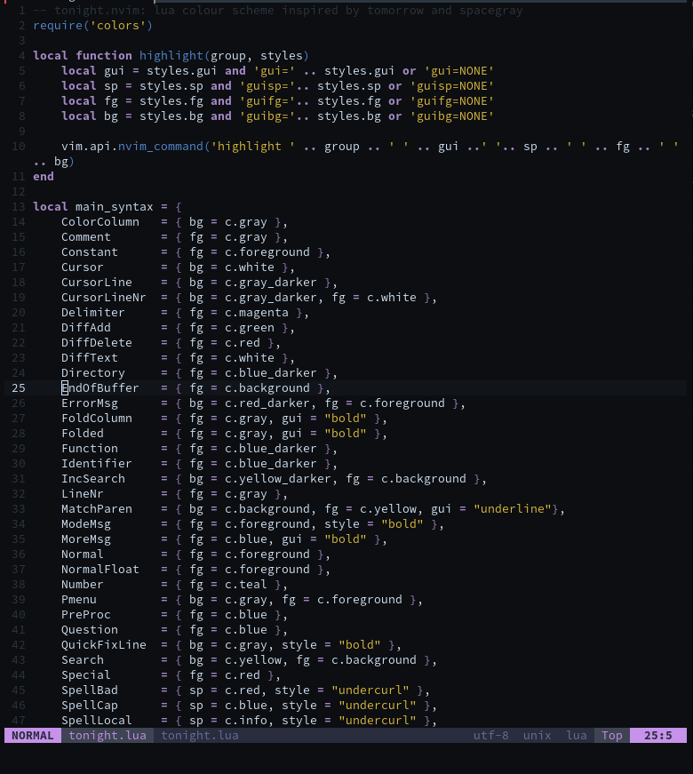

# tonight.nvim 🌙

Tonight is a dark colour scheme for [Neovim](https://github.com/neovim/neovim) written in Lua and based on [Tomorrow Dark](https://github.com/chriskempson/base16-tomorrow-scheme) and [Spacegray](https://github.com/ackyshake/Spacegray.vim).

## Why?

I made it because the aforementioned colour schemes are great but quite dim and unappealing to look at over long periods of time. The main idea is to look at a colour and know instantly what it is *every single time* without the mental overhead of staring at it too long. This, for me, does that.

## Screenshots

#### Font: Terminus

#### Font: JetBrains Mono

#### Font: Source Code Pro

## Features

- Easy on the eyes for long periods of time
- Terminal colour schemes
- Soon to support:
    - Neovim LSP
    - [barbar.nvim](https://github.com/romgrk/barbar.nvim)
    - [lualine.nvim](https://github.com/hoob3rt/lualine.nvim)
    - [telescope.nvim](https://github.com/nvim-telescope/telescope.nvim)

## Todo

- [x] Write a proper README
- [ ] Plugin support
    - [ ] barbar.nvim
    - [ ] LSP
    - [ ] Lualine
    - [ ] Telescope
- [x] Screenshots (who doesn't love those?)
- [x] Terminal Schemes
